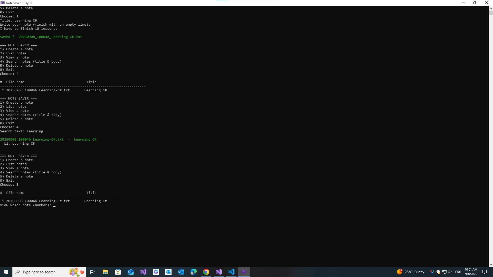

# 🗒️ Note Saver (C# Console App)

This is **Day 11** of my 30-Day C# Project-Based Learning Plan.  
A simple **CLI note manager** that saves notes as `.txt` files in a `notes/` folder.  
You can create, list, view, search, and delete notes using plain text persistence.

---

## 🚀 Features
- Create notes with a title and multi-line body
- Auto-slugged filenames with timestamp (e.g., `20250908_123045_my-note-title.txt`)
- List notes (filename + title), newest first
- View note content in the console
- Search across **titles and bodies** (case-insensitive)
- Delete notes with confirmation
- Safe filenames (invalid characters handled)

---

## 🛠️ Tech Stack
- Language: **C#**
- Framework: **.NET 6/7/8**
- APIs: `System.IO` (`File`, `Directory`, `Path`, `StreamReader/Writer`)
- IDE: Visual Studio (or VS Code)

---

## 📸 Screenshots

| 🗒️ |
|-----|
| |

----

## 🧭 Usage

1) Create a note → enter Title → type lines → press Enter on an empty line to finish

2) List notes → shows index, filename, and title

3) View a note → pick by number from the list

4) Search notes → finds matches in both title and body

5) Delete a note → pick by number, confirm y/n

0) Exit

----

## 📚 Learning Goals

- Working with files and directories via System.IO

- Safely generating filenames (slugify + timestamps)

- Reading/writing UTF-8 text with StreamWriter/StreamReader

- Building a practical CLI around plain text persistence
